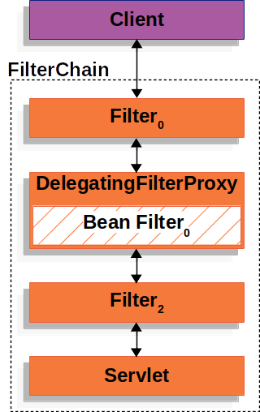

[출처]https://docs.spring.io/spring-security/reference/servlet/architecture.html

## A Review of Filters
스프링 시큐리티의 Servlet support는 Servlet `Filter`들 기반이다. 그래서 `Filter`들의 역할을 먼저 보는게 도움이 된다. 아래 그림은 단일 HTTP 요청에 대한  handlers의 전형적인 layering이다.

client가 app에 요청을 보내면, container를 `FilterChain`을 만든다. (`FilterChain`은 `Filter`들과 `Servlet`을 가지고 있고, request URI 경로 기반으로 `HttpServletRequest`를 처리한다) Spring MVC 앱에서 `Servlet`은 `DispatcherServlet`의 인스턴스다. 최대 하나의 `Servlet`이 단일 `HttpServletRequest`와 `HttpServletResponse`를 처리할 수 있지만, 두 개 이상의 `Filter`를 사용하여 다음을 수행할 수 있다:
- downstream의 `Filter`들과 `Servlet`이 실행되는 걸 막는다. 이 인스턴스에서 `Filter`는 `HttpServletResponse`를 작성한다.
- downstream의 `Filter`들과 `Servlet`에서 사용되는 `HttpServletRequest` 또는 `HttpServletResponse`를 수정한다.

`Filter`의 힘은 `FilterChain`에서 온다.

*Example 1. FilterChain Usage Example*
~~~java
public void doFilter(ServletRequest request, ServletResponse response, FilterChain chain) {
    // do something before the rest of the application
    chain.doFilter(request, response); // invoke the rest of the application
    // do something after the rest of the application
}
~~~
`Filter`가 오직 downstream의 `Filter`들과 `Servlet`에만 영향을 미치기 때문에, `Filter`의 순서가 매우 중요합니다.

## DelegatingFilterProxy
스프링은 `DelegatingFilterProxy`라는 `Filter`구현체를 제공한다.(Servlet container의 lifecycle과 스프링의 `ApplicationContext`를 연결해주는 역할을 합니다.) Servlet container는 자신만의 표준에 따라 `Filter`들을 등록합니다. 하지만 Spring Bean들을 알지 못하죠. `DelegatingFilterProxy`은 표준 Servlet container 메커니즘들을 통해 등록될 수 있습니다. 하지만 모든 일들을 `Filter`를 구현한 Spring Bean에게 위임합니다.

이 그림은 `DelegatingFilterProxy`가 `Filter`들과 `FilterChain`에 어떻게 적용되는지에 대한 그림입니다.

`DelegatingFilterProxy`는 `ApplicationContext`에서 *Bean Filter0*를 찾은 다음, *Bean Filter0*를 실행시킵니다. `DelegatingFilterProxy`의 pesudo 코드는 아래에서 볼 수 있습니다.

*Example 2. DelegatingFilterProxy Pseudo Code*
~~~java
public void doFilter(ServletRequest request, ServletResponse response, FilterChain chain) {
	// Lazily get Filter that was registered as a Spring Bean
	// For the example in DelegatingFilterProxy
        // delegate is an instance of Bean Filter0
	Filter delegate = getFilterBean(someBeanName);
	// delegate work to the Spring Bean
	delegate.doFilter(request, response);
}
~~~

`DelegatingFilterProxy`의 또 다른 이점은 `Filter` bean 인스턴스들을 찾는데 delaying을 허용한다는 것입니다. 이건 중요합니다. 왜냐하면 container는 container가 startup 할 수 있기 전에 `Filter` 인스턴스들을 등록해야하기 때문입니다. 하지만, Spring은 전형적으로 Spring Bean들을 load하는데 `ContextLoaderListener`를 사용합니다.(`Filter` 인스턴스들이 등록된 후까지 작업이 완료되지 않습니다.)

## FilterChainProxy

스프링 시큐리티의 Servlet support는 `FilterChainProxy`안에 포함되어 있습니다. `FilterChainProxy`는 특별한 `Filter`이고, 스프링 시큐리티에 의해 제공됩니다.(많은 `Filter` 인스턴스들의 일을 `SecurityFilterChain`으로 위임합니다) `FilterChainProxy`가 빈이기 때문에, 일반적으로 `DelegatingFilterProxy`에 의해 랩핑됩니다.

## SecurityFilterChain
`SecurityFilterChain`은 `FilterChainProxy`에 의해 사용되고, 해당 요청에 대해 어떤 스프링 시큐리티 `Filter`들이 실행되어야하는지 결정합니다.

`SecurityFilterChain`안의 Security Filter들은 보통 Bean들이다. 하지만 걔네들은 DelegatingFilterProxy `FilterChainProxy`에 등록된다.
`FilterChainProxy`는 Servlet container에 직접 등록하거나 DelegatingFilterProxy에 등록할 수 있는 여러 장점을 제공해준다. 첫 번째로, 모든 스프링 시큐리티의 Servlet support의 시작점을 제공해준다. 그렇기 때문에, 만약 스프링 시큐리티의 Servlet support의 troubleshoot을 해결하려한다면, FilterChainProxy에 디버그 포인트를 잡는게 시작하기에 아주 좋다.  

두 번째로, `FilterChainProxy`는 스프링 시큐리티 사용의 중심이기 때문에 선택사항이 아닌 것들만 수행할 수 있습니다. 예를 들어 메모리 leaks을 피하기 위해 `SecurityContext`을 지웁니다. 또, 특정 유형의 공격으로부터 app을 보호하기 위해 스프링 시큐리티의 HttpFirewall를 적용합니다.

마지막으로, `SecurityFilterChain`이 실행되어야 하는지를 유연하게 결정할 수 있다. Servlet container에서, `Filter`들은 URL기반으로 실행이 된다. 하지만 `FilterChainProxy`는 `HttpServletRequest`안의 어느 것 기반으로든 실행을 결정할 수 있다.(RequestMatcher 인터페이스를 활용)

사실, `FilterChainProxy`는 어떤 `SecurityFilterChain`이 사용되어야하는지를 결정하는데 사용할 수 있습니다. 그러면 app의 여러 슬라이스에 대한 완전 분리된 설정을 제공할 수 있습니다.

Multi SecurityFilterChain 그림에서 `FilterChainProxy`는 어떤 `SecurityFilterChain`이 사용되야하는지 결정합니다. 오직 matching된 첫번째 `SecurityFilterChain`만 실행될겁니다. 만약 `/api/messages/`의 URL이 요청되면, `SecurityFilterChain0`의 패턴 `/api/**`과 match가 될 것이고, `SecurityFilterChain0`만 실행될겁니다.(`SecurityFilterChainN`이 match된다고 하더라도) 만약 `/messages/` URL이 요청되면 `SecurityFilterChain0`의 패턴 `/api/**`과는 match가 안될 거고, 그래서 `FilterChainProxy`는 각각의 `SecurityFilterChain`을 시도할 겁니다. 아무것도 없었다고 치면, `SecurityFilterChainN`과 match된 `SecurityFilterChain`인스턴스가 실행될겁니다.

기억하세요. `SecurityFilterChain0`는 3개의 security `Filter`인스턴스들로 구성되어 있고, `SecurityFilterChainN`은 4개의 security `Filter`들로 구성되어 있습니다. 이건 중요합니다. 각각의 `SecurityFilterChain`는 독립적으로 유니크하게 구성될 수 있습니다. 만약, app이 특정 요청들은 스프링 시큐리티를 무시하길 바란다면, `SecurityFilterChain`는 0개의 security `Filter`들을 가질 수도 있습니다.

## Security Filters
시큐리티 필터들은 FilterChainProxy안으로 넣어집니다.(SecurityFilterChain API를 이용해서) `Filter`들의 순서가 중요합니다. 일반적으로 스프링 시큐리티의 `Filter`들의 순서를 알 필요는 없지만, 알면 좋을 때도 있습니다.

다음은 스프링 시큐리티 필터 순서의 목록입니다:
- ChannelProcessingFilter
- WebAsyncManagerIntegrationFilter
- SecurityContextPersistenceFilter
- HeaderWriterFilter
- CorsFilter
- CsrfFilter
- LogoutFilter
- OAuth2AuthorizationRequestRedirectFilter
- Saml2WebSsoAuthenticationRequestFilter
- X509AuthenticationFilter
- AbstractPreAuthenticatedProcessingFilter
- CasAuthenticationFilter
- OAuth2LoginAuthenticationFilter
- Saml2WebSsoAuthenticationFilter
- UsernamePasswordAuthenticationFilter
- OpenIDAuthenticationFilter
- DefaultLoginPageGeneratingFilter
- DefaultLogoutPageGeneratingFilter
- ConcurrentSessionFilter
- DigestAuthenticationFilter
- BearerTokenAuthenticationFilter
- BasicAuthenticationFilter
- RequestCacheAwareFilter
- SecurityContextHolderAwareRequestFilter
- JaasApiIntegrationFilter
- RememberMeAuthenticationFilter
- AnonymousAuthenticationFilter
- OAuth2AuthorizationCodeGrantFilter
- SessionManagementFilter
- ExceptionTranslationFilter
- FilterSecurityInterceptor
- SwitchUserFilter

## Handling Security Exceptions
`ExceptionTranslationFilter`는 `AccessDeniedException`과 `AuthenticationException`의 HTTP response 안으로의 변환을 허용해줍니다.
`ExceptionTranslationFilter`는 FilterChainProxy안에 Security Filter들 중 하나로 들어갑니다.

-  첫 번째로, `ExceptionTranslationFilter`는 app의 나머지를 실행하기 위해 `FilterChain.doFilter(request, response)`를 실행합니다.
-  만약 user가 인증되지 않았거나 `AuthenticationException`이라면, *인증을 시작합니다.*
  - SecurityContextHolder는 비워집니다.
  - `HttpServletRequest`는 `RequestCache`에 저장됩니다. 만약 user가 인증을 성공하면, `RequestCache`는 원래의 요청을 재실행하기 위해 사용됩니다.
  - `AuthenticationEntryPoint`는 클라이언트에게 자격증명을 요청하기 위해 사용됩니다. 예를 들면, 로그인 페이지로 리다이렉션하거나 `WWW-Authenticate` header를 전송할 수 있습니다.
  - 반면 `AccessDeniedException`이라면, *접근은 거부됩니다.* `AccessDeniedHandler`는 실행되고 접근 거부를 처리합니다.
    
**기억하기**
만약 app이 `AccessDeniedException`이나 `AuthenticationException`을 발생시키지 않으면 `ExceptionTranslationFilter`는 아무 일도 하지 않습니다.

`ExceptionTranslationFilter`의 pseudo코드는 아래와 같습니다:
*ExceptionTranslationFilter pseudocode*
~~~java
try {
    filterChain.doFilter(request, response); // 1.
} catch (AccessDeniedException | AuthenticationException ex) {
    if (!authenticated || ex instanceof AuthenticationException) {
        startAuthentication(); // 2.
    } else {
        accessDenied(); // 3.
    }
}
~~~
1. A Review of Filters로부터 FilterChain.doFilter(request, response)는 나머지 app을 호출하는 부분과 똑같다는 것이 생각날겁니다. 만약 app의 다른 부분에서 AuthenticationException이나 AccessDeniedException을 발생시키면, 이곳에서 잡아서 처리한다는 것을 의미합니다.
2. user가 인증되지 않았거나 `AuthenticationException`이라면, *인증을 시작합니다.*
3. 그렇지 않으면, *접근은 거부됩니다.*