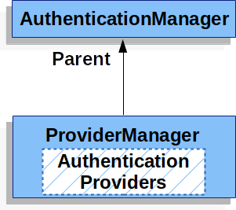
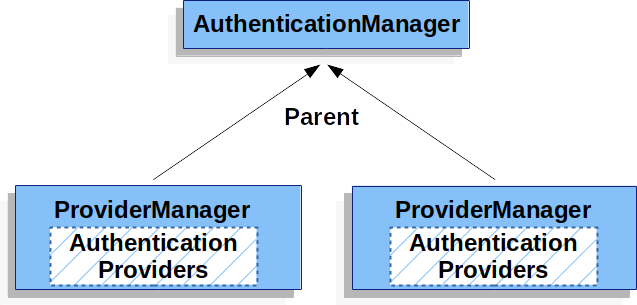
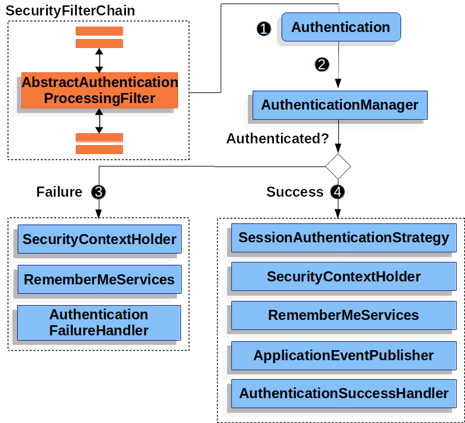

# Servlet Authentication Architecture

이 논의는 Servlet 인증에 사용되는 스프링 시큐리티의 주요 구조적 컴포넌트들을 설명하기 위해 Servlet Security: The Big Picture를 확장한다. 만약 각각의 부분들이 어떻게 조화를 이루는지 구체적인 흐름이 필요하다면, Authentication Mechanism의 특정 섹션들을 봐라.

- SecurityContextHolder - `SecurityContextHolder`는 누가 인증됐는지 정보들이 저장되는 스프링 시큐리티의 저장소입니다.
- SecurityContext - `SecurityContextHolder`로부터 얻을 수 있고, 현재 인증된 사용자의 `Authentication`를 포함하고 있습니다.
- Authentication - Can be the input to AuthenticationManager to provide the credentials a user has provided to authenticate or the current user from the SecurityContext.
- GrantedAuthority - An authority that is granted to the principal on the Authentication (i.e. roles, scopes, etc.)
- AuthenticationManager - the API that defines how Spring Security’s Filters perform authentication.
- ProviderManager - the most common implementation of AuthenticationManager.
- AuthenticationProvider - used by ProviderManager to perform a specific type of authentication.
- Request Credentials with AuthenticationEntryPoint - used for requesting credentials from a client (i.e. redirecting to a log in page, sending a WWW-Authenticate response, etc.)
- AbstractAuthenticationProcessingFilter - a base Filter used for authentication. This also gives a good idea of the high level flow of authentication and how pieces work together.

## SecurityContextHolder

안녕 servlet/authentication/architecture

스프링 시큐리티 인증 모델의 중심에는 `SecurityContextHolder`가 있다. 이건 SecurityContext를 가지고 있다.

`SecurityContextHolder`는 스프링 시큐리티가 인증된 사용자들의 정보를 저장하는 곳입니다. 스프링 시큐리티는 `SecurityContextHolder`가 어떻게 값을 저장하는지는 관여하지 않습니다. 만약 값을 가지고 있다면, 현재 인증된 사용자로 사용됩니다.

사용자가 인증되었음을 나타내는 가장 간단한 방법은 `SecurityContextHolder`를 직접 setting하는 것입니다.

*Example 1. Setting SecurityContextHolder*
~~~java
SecurityContext context = SecurityContextHolder.createEmptyContext(); // 1.
Authentication authentication = new TestingAuthenticationToken("username", "password", "ROLE_USER"); // 2.
context.setAuthentication(authentication);

SecurityContextHolder.setContext(context); // 3.
~~~
1. 빈 SecurityContext를 생성하면서 시작합니다. 새로운 SecurityContext 인스턴스를 만드는 것은 중요합니다. SecurityContextHolder.getContext().setAuthentication(authentication)를 사용하는 것은 멀티 스레드 환경에서 경합할 수도 있습니다.
2. 다음으로 새로운 Authentication 객체를 만듭니다. 스프링 시큐리티는 어떤 타입의 Authentication 구현체가 SecurityContext에 저장되는지 관심이 없습니다. 여기선 TestingAuthenticationToken이 간단하기 때문에 썼습니다. 좀 더 일반적인 프로덕션 시나리오는 UsernamePasswordAuthenticationToken(userDetails, password, authorities)입니다.
3. 마지막으로 SecurityContextHolder에 SecurityContext를 저장합니다. 스프링 시큐리티는 이 정보를 허가(authorization)에서 사용할 것입니다.

만약 로그인된 유저(Principal)의 정보를 얻고 싶다면, `SecurityContextHolder`에 접근해서 얻을 수 있습니다.

*Example 2. Access Currently Authenticated User*
~~~java
SecurityContext context = SecurityContextHolder.getContext();
Authentication authentication = context.getAuthentication();
String username = authentication.getName();
Object principal = authentication.getPrincipal();
Collection<? extends GrantedAuthority> authorities = authentication.getAuthorities();
~~~

기본적으로 `SecurityContextHolder`는 이런 정보들을 저장하기 위해 `ThreadLocal`을 사용합니다.(스레드들과 일하는 특정 방식 때문에) 이건 `SecurityContext`는 같은 스레드의 메소드에서 항상 사용 가능함을 의미합니다.(인자로 전달받지 않더라도요) `ThreadLocal`을 사용하는 방법은 현재 사용자 정보를 다 사용한 다음에 지우기만 한다면 완전 안전합니다. 스프링 시큐리티의 FilterChainProxy가 `SecurityContext`가 그 일을 해줍니다.

몇몇 app들은 해당 app에서 스레드들이 동작하는 방식 때문에 `ThreadLocal`을 쓰는게 맞지 않을 수 있습니다. 예를 들면, Swing client는 JVM의 모든 스레드들이 같은 security context를 사용하길 바랄 수 있습니다. `SecurityContextHolder`는 context에 저장하는 방법을 정하기 위해 시작할 때 strategy를 설정할 수 있습니다. standalone app에선 SecurityContextHolder.MODE_GLOBAL strategy를 쓸 수 있습니다. Other applications might want to have threads spawned by the secure thread also assume the same security identity. This is achieved by using SecurityContextHolder.MODE_INHERITABLETHREADLOCAL. You can change the mode from the default SecurityContextHolder.MODE_THREADLOCAL in two ways. The first is to set a system property, the second is to call a static method on SecurityContextHolder. Most applications won’t need to change from the default, but if you do, take a look at the Javadoc for SecurityContextHolder to learn more.

## SecurityContext
`SecurityContext`는 SecurityContextHolder에서 얻을 수 있습니다. `SecurityContext`는 Authentication 객체를 포함하고 있습니다.

## Authentication
`Authentiation`은 스프링 시큐리티에서 2가지 목적으로 사용됩니다:
* 인증을 제공한 사용자에게 자격을 제공하기 위한 `AuthenticationManager`의 입력으로 사용됩니다. 시나리오에서 사용되면 isAuthenticated()는 false를 반환합니다.
* 현재 인증된 사용자를 나타냅니다. 현재 `Authentication`은 SecurityContext에서 얻을 수 있습니다.

`Authentication`은 다음을 가지고 있습니다:
* `principal` - 사용자를 식별해줍니다. username/password 인증에서 이건 종종 `UserDetails`의 인스턴스입니다.
* `credentials` - 보통 비밀번호입니다. 많은 경우에 사용자가 인증된 이후에 유출되지 않기 위해 clear됩니다.
* `authorities` - `GrantedAuthority`들은 사용자가 인증됐다는 높은 수준의 권한입니다. 몇몇의 예로는, 역할들과 스코프들이 있습니다.

## GrantedAuthority
`GrantedAuthority`들은 `Authentication.getAuthorities()`메소드로부터 얻을 수 있습니다. 이 메소드는 `GrantedAuthority`객체들의 `Collection`을 제공합니다. `GrantedAuthority`는 당연하지만 권한이고, principal(사용자)에게 부여됩니다. 이런 권한들은 보통 "역할들"이며, ROLE_ADMINISTRATOR 또는 ROLE_HR_SUPERVISOR과 같은 역할을 합니다. 이런 역할들은 나중에 웹 권한, 메소드 권한 그리고 도메인 객체 권한에 대해 설정됩니다. 스프링 시큐리티의 다른 부분들은 이런 권한들을 해석할 수 있으며, 권한들이 존재하기를 기대합니다. username/password 기반 인증을 사용하면 `GrantedAuthority`들은 보통 `UserDetailsService`에 의해 불러집니다.

보통 `GrantedAuthority`객체들은 app전체에 걸친 허가입니다. 그들은 특정 도메인 객체에 한정되지 않습니다. 그래서 직원 객체 번호54에 대한 허가를 나타내는 GrantedAuthority를 가지진 못합니다. 왜냐하면 만약 그런 수천개의 권한들이 있다면 메모리가 빠르게 바닥날겁니다.(혹은 최소, app이 사용자를 인증하는데 오랜 시간이 걸리는 원인이 될 수 있습니다) 물론, 스프링 시큐리티는 이런 일반적인 요구들을 다루기 위해 설계되었습니다. 대신 이런 목적으로는 프로젝트의 도메인 객체 보호 기능을 사용할 수 있습니다.

## AuthenticationManager
`AuthenticationManager`는 스프링 시큐리티의 필터들이 어떻게 인증을 정의하는가에 대한 API입니다. 반환된 `Authenticaion`은 `AuthenticationManager`를 호출하는 컨트롤러에 의해 SecurityContextHolder에 저장됩니다.(스프링 시큐리티의 필터들 같은) 만약 스프링 시큐리티의 필터들을 통합하지 않았다면 `SecurityContextHolder`에 직접 저장할 수 있고, `AuthenticaionManager`가 굳이 필요 없습니다.

`AuthenticaionManager`의 구현체는 어떤 것이든 상관없지만, 가장 일반적인 구현체는 `ProviderManager`입니다.

## ProviderManager
`ProviderManager`는 `AuthenticationManager`의 구현체로 가장 많이 사용됩니다. `ProviderManager`는 `AuthenticationProvider`들의 `List`의 일을 위임합니다. 각각의 `AuthenticationProvider`는 인증이 성공하거나 실패했다는걸 나타낼 기회를 가지고 있습니다. 또는 결정을 내리지 않고, downstream의 `AuthenticationProvider`가 결정하게 합니다. 만약 어떠한 설정된 `AuthenticationProvider`들도 인증(결정)하지 못한다면, 인증은 `ProviderNotFoundException`와 함께 실패할겁니다. 해당 예외는 특별한 `AuthenticationException`입니다. 그건 `ProviderManager`가 건네받은 정보를 인증하는데 아무 지원도 설정되지 않았다는걸 나타냅니다.

실제로는 각각 `AuthenticationProvider`들은 특정 타입의 인증을 어떻게 해야하는지 알고 있습니다. 예를 들면, 한 `AuthenticationProvider`는 username/password를 타당한지 검사할 수 있습니다, 반면 다른 `AuthenticationProvider`는 SAML확인 인증을 할 수 있습니다. 이건 각각의 `AuthenticationProvider`들이 특정 타입의 인증을 할 수 있게 해줍니다. 그 결과 `AuthenticationManager` bean 하나만 노출하면서, 여러 타입의 인증을 진행할 수 있습니다.

`ProviderManager`는 또한 선택적으로 부모 `AuthenticationManager`를 설정할 수 있다. 설정하면, 인증할 수 있는 `AuthenticationProvider`가 없으면 부모에게 상의를 한다.(부모 AuthenticationManager에게 인증 수행요청함) 부모는 어떤 종류의 `AuthenticationManager`여도 상관없지만 얘도 보통 `ProviderManager`의 인스턴스다.

사실 다수의 `ProviderManager`객체들은 같은 부모`AuthenticationManager`를 공유할지 모릅니다. 이건 다수의 `SecurityFilterChain`객체들이 몇몇 인증을 가지고 있거나, 다른 인증 체계(다른 `ProviderManger`객체를 가짐)를 가지고 있다 하더라도 다소 일반적인 시나리오입니다.

기본적으로 `ProviderManager`는 인증요청이 성공하면 `Authentication`에서 민감한 자격정보들은 지웁니다. 이건 비밀번호 같은 정보가 HttpSession에서 필요한 시간보다 더 오래 보관되는걸 막아줍니다.

이건 무상태 app의 performance를 향상 시키기 위해 유저 객체의 캐시를 사용하려할 때, 문제를 야기할 수도 있습니다. If the Authentication contains a reference to an object in the cache (such as a UserDetails instance) and this has its credentials removed, then it will no longer be possible to authenticate against the cached value. You need to take this into account if you are using a cache. An obvious solution is to make a copy of the object first, either in the cache implementation or in the AuthenticationProvider which creates the returned Authentication object. Alternatively, you can disable the eraseCredentialsAfterAuthentication property on ProviderManager. See the Javadoc for more information.

## AuthenticationProvider
다수의 `AuthenticationProvider`들은  `ProviderManager`에 주입될 수 있습니다. 각각의 `AuthenticationProvider`는 특정 타입의 인증을 수행합니다. 예를 들면, `DaoAuthenticationProvider`는 username/password 기반 인증을 지원하고, `JwtAuthenticationProvider`는 JWT 토큰을 인증하는 것을 지원합니다.

## Request Credentials with AuthenticationEntryPoint
`AuthenticationEntryPoint`는 client로부터 자격증명이 필요하다고 요청하는 HTTP 응답을 보내기 위해 사용됩니다.

때때로 client는 선행적으로 username/password같은 자격정보를 resource를 요청하기 위해 포함시킬 수 있습니다. 이런 경우에 스프링 시큐리티는 자격증명이 필요하다는 요청을 하는 HTTP 응답을 제공할 필요가 없습니다. 왜냐하면 자격증명들이 이미 있기 때문입니다.

다른 경우를 보면, clien는 접근 권한이 없는 resource에 인증없이 요청을 보낼 수 있습니다. 이런 경우에도 client에게 자격정보를 요청하기 위해 `AuthenticationEntryPoint`는 사용됩니다. `AuthenticationEntryPoint`구현체는 로그인 페이지로 redirect, WWW-Authenticate 헤더를 포함한 응답 등의 일을 수행할지도 모릅니다.

## AbstractAuthenticationProcessingFilter
`AbstractAuthenticationProcessingFilter`은 user의 자격정보를 인증하는데 쓰이는 기본 `Filter`로 사용됩니다. 자격정보가 인증되기 전에 스프링 시큐리티는 보통 `AuthenticationEntryPoint`를 이용해 자격정보를 요청합니다.

다음, `AbstractAuthenticationProcessingFilter`는 어떤 인증요청이던지 인증할 수 있습니다.

 user가 자격정보를 제출하면, `AbstractAuthenticationProcessingFilter`는 인증하려는 `HttpServletRequest`로부터 `Authentication`을 생성합니다. 생성된 `Authentication`의 타입은 `AbstractAuthenticationProcessingFilter`의 하위 클래스에게 달려있습니다. 예를 들면 `UsernamePasswordAuthenticationFilter`는 `HttpServletRequest`안에 제출된 username과 password로부터 `UsernamePasswordAuthenticationToken`을 생성합니다.

 다음, `Authentication`은 인증되기 위해 `AuthenticationManager`에게 전달됩니다.

 만약 인증이 실패하면,
- SecurityContextHolder는 비워집니다.
- `RememberMeServices.loginFail`이 실행됩니다. remember me가 설정되어 있지 않으면, 아무 일도 일어나지 않습니다.
- `AuthenticationFailureHandler`가 실행됩니다.

 인증이 성공하면
- SessionAuthenticationStrategy는 새로 로그인 된 사실을 알게 됩니다.
- Authentication은 SecurityContextHolder에 저장됩니다. 후에 `SecurityContextPersistenceFilter`는 `SecurityContext`를 `HttpSession`에 저장합니다.
- `RememberMeServices.loginSuccess`가 실행됩니다. remember me가 설정되어 있지 않으면, 아무 일도 일어나지 않습니다.
- `ApplicationEventPublisher`가 `InteractiveAuthenticationSuccessEvent`를 발행합니다.
- `AuthenticationSuccessHandler`가 실행됩니다.
